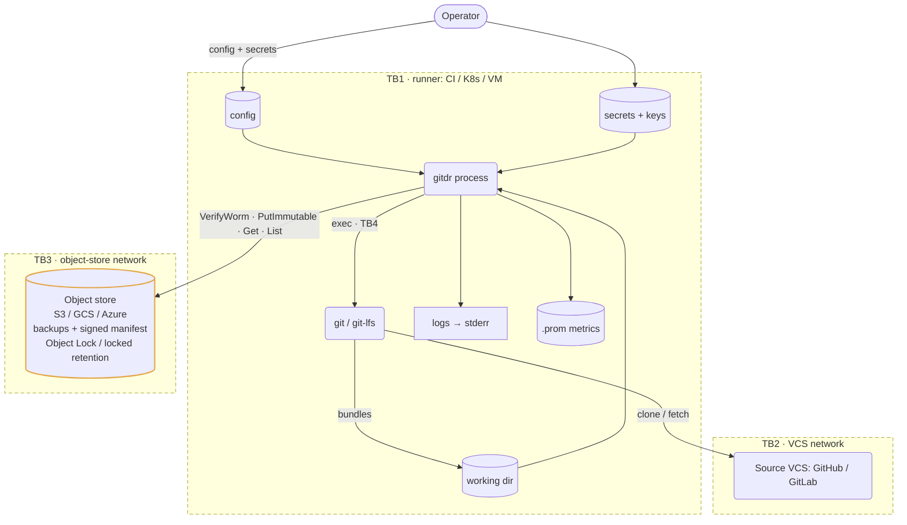

# gitdr, threat model

A STRIDE threat model. Data-flow diagram with trust boundaries, per-element threat
enumeration, a risk register, and residual risks. Tracks the design in
[`SPEC.md`](./SPEC.md), read it alongside [`SECURITY.md`](./SECURITY.md).

## 1. Scope, method, and the one goal

Method: STRIDE (Spoofing, Tampering, Repudiation, Information disclosure, Denial of
service, Elevation of privilege), applied per element of the DFD in §3. Each element that
crosses a trust boundary is examined for the applicable STRIDE categories with its
mitigation and residual risk. §7 rates the resulting threats by Likelihood times Impact.

The overriding goal: a full compromise of the source VCS or the runner must not let an
attacker destroy backups already written. Destination immutability is the backstop, and
everything else reduces the blast radius around it.

## 2. Assets

| Asset | Why it matters |
|---|---|
| Backups at rest (bundles, LFS, metadata) | The thing being protected. Must survive attacks on the VCS and on the pipeline |
| Run-manifest + ed25519 signature | Proves what was backed up and that artifacts are intact |
| Manifest signing key (private) | Forges manifests if stolen |
| Encryption KEK (`GITDR_ENCRYPTION_KEY`) | Decrypts backups if stolen |
| Source VCS credential | Read access to all source repos |
| Destination credential | Write access to backup storage |

## 3. Data-flow diagram

Rounded boxes are processes, cylinders are data stores, dashed frames are trust
boundaries.

Trust boundaries. TB1 the runner (secrets live here, anything inside is as trusted as the
runner). TB2 the network to the VCS. TB3 the network to the object store (immutability is
enforced on the far side). TB4 the `gitdr` to `git` subprocess (argv/env exposure).

## 4. Assumptions and out of scope

- The cloud provider correctly enforces Object Lock / locked retention once gitdr has
  verified it. Account root can't bypass COMPLIANCE within the window.
- The runner isn't already rooted before the job starts, the container runtime and kernel
  are sound, and TLS/PKI to the VCS and store is intact.
- Out of scope: availability of the upstream VCS, the cloud provider's own control plane,
  host or physical compromise of the runner before execution, and metadata fidelity (the
  issue/PR JSON is audit-only by design, not a confidentiality or integrity target).

## 5. STRIDE analysis (per element)

Ratings: L/M/H Likelihood times Impact. "Residual" is what remains after the mitigation.

### E1, flow: gitdr to Source VCS (TB2)
| STRIDE | Threat | Mitigation | L×I / residual |
|---|---|---|---|
| S | Impersonated VCS endpoint | TLS cert validation, pinned base URL | L×M / low |
| T | MITM alters fetched repo data | TLS, and corruption is caught later by checksums on the stored artifact | L×M / low |
| I | Token leaked on the wire or in process args | Token injected via `GIT_CONFIG_*` env, never argv. TLS, redaction | M×H / low |
| D | VCS rate-limits or blocks the run | Bounded concurrency, backoff, resumable, fail-closed | M×L / low |

### E2, subprocess: gitdr to git / git-lfs (TB4)
| STRIDE | Threat | Mitigation | L×I / residual |
|---|---|---|---|
| T/E | Argument injection via crafted repo name or URL | `--` end-of-options guards, no shell, validated inputs | L×H / low |
| I | Token visible in argv or `/proc` | Auth via env, never the command line | M×H / low |

### E3, data store: secrets and keys on the runner (TB1)
| STRIDE | Threat | Mitigation | L×I / residual |
|---|---|---|---|
| I | Secrets in image, logs, or core dumps | No secrets baked in, env or mounted only, `redact.Secret`, no telemetry | M×H / med |
| T | Signing key swapped to forge manifests | Operator-controlled provisioning, keep the key off-runner or in KMS | L×H / med |
| E | A credential is over-scoped and reused | Source read-only, destination create/put-only, prefer keyless workload identity | M×H / low |

### E4, flow: gitdr to object store, VerifyWorm/PutImmutable (TB3)
| STRIDE | Threat | Mitigation | L×I / residual |
|---|---|---|---|
| S | Impersonated store endpoint | SDK TLS, provider default credential chain | L×M / low |
| T | Writes land on a non-immutable destination | gitdr verifies immutability and warns loudly, `--require-worm` fails closed for a hard guarantee. WORM is the operator's responsibility | M×H / med |
| R | Ambiguity over what was written | Signed run-manifest records every artifact, key, size, checksum | n/a / low |
| I | Data readable by the storage provider | Bucket SSE plus optional client-side envelope encryption | M×M / med |
| E | Credential able to delete or overwrite | No delete or overwrite method exists in the code, create-only `IfNoneMatch`, least-privilege cred | L×H / low |

### E5, data store: backups + signed manifest at rest (TB3)
| STRIDE | Threat | Mitigation | L×I / residual |
|---|---|---|---|
| T | Object bytes flipped or swapped | SHA-256 per artifact plus ed25519-signed manifest (`verify` detects it), Object Lock prevents overwrite within retention | L×H / low |
| R | A forged "good" backup is planted | Manifest signature verified with the operator's public key | L×H / low |
| I | Bucket read access exposes contents | SSE plus optional client-side encryption (checksums cover ciphertext, so `verify` stays key-free) | M×M / med |
| D | Retention expires and objects become deletable | Set retention at or above your RPO and threat horizon (operator policy) | M×M / med |
| E | Privileged insider or root deletes early | COMPLIANCE blocks all principals within the window, GOVERNANCE does not | L×H / low (COMPLIANCE) |

### E6, process: gitdr pipeline itself (TB1 + supply chain)
| STRIDE | Threat | Mitigation | L×I / residual |
|---|---|---|---|
| T | Trojaned binary, dependency, or image | Pinned deps plus `go.sum` plus `-mod=readonly`, `govulncheck`, SBOM, cosign keyless plus SLSA provenance, digest-pinned non-root shell-less image | L×H / low |
| R | A run leaves no auditable record | Signed manifest, structured logs, `gitdr_last_successful_run` metric | n/a / low |
| D | Partial or failed run reported as success | Fail-closed, non-zero exit on any repo or artifact failure, per-repo status in the manifest | L×H / low |

### E7, flow: operator to config and secrets (TB1)
| STRIDE | Threat | Mitigation | L×I / residual |
|---|---|---|---|
| T | Unsafe config (gate disabled, GOVERNANCE, weak retention) | Safe defaults (COMPLIANCE expected, gate on), `doctor` surfaces the actual lock state before the run | M×M / med |
| S/E | Who may submit config or trigger a run | Runner RBAC, operator responsibility (§8) | n/a / med |

## 6. Mapped attack scenarios

The headline scenarios, resolved by the controls above.

- Org wiped or account compromised (E1, E5). Prior backups are in separate, immutable
  storage. Restore from the last good run.
- Ransomware or compromised CI holds the pipeline plus the destination credential (E3, E4,
  E5). Create-only credential plus COMPLIANCE retention. Existing objects can't be deleted
  or overwritten, and new writes can't clobber old ones (`IfNoneMatch`).
- Tamper with backups at rest (E5). Checksums plus signed manifest detect it, and
  immutability prevents it within the window.
- Supply-chain attack on gitdr (E6). Verify cosign signatures and provenance before you
  deploy. Pinned, scanned, minimal dependencies.

## 7. Risk register (top threats)

| ID | Threat | L | I | Risk | Primary control |
|---|---|---|---|---|---|
| T1 | Compromised pipeline or credential purges backups | M | H | High | Create-only API plus COMPLIANCE Object Lock (when configured) |
| T2 | Backups written without real immutability | M | H | High | WORM verified and warned, `--require-worm` to enforce, `doctor` surfaces it |
| T3 | Secret exfiltration from the runner | M | H | High | Env-only plus redaction plus least privilege plus keyless WI |
| T4 | Supply-chain compromise of gitdr | L | H | Med | cosign/SLSA/SBOM, pinned deps, hardened image |
| T5 | Backup tampering at rest | L | H | Med | Checksums plus signed manifest plus Object Lock |
| T6 | Confidentiality vs the storage provider | M | M | Med | Client-side envelope encryption |
| T7 | Retention expiry leaves data deletable | M | M | Med | Retention at or above RPO, lifecycle policy |
| T8 | Signing-key or KEK compromise | L | H | Med | Keys off-runner (KMS/HSM), scoped, rotated, stored apart from backups |

## 8. Residual risks and operator responsibilities

The High risks drop to Low only if the operator holds up their side.

- Lock retention in COMPLIANCE (GOVERNANCE and unlocked policies are bypassable).
- Scope the destination credential create/put-only and the source read-only, and prefer
  keyless workload identity.
- Keep the signing key and KEK off the runner where possible, and separate from the
  backups they protect. Rotate them.
- WORM is not enforced by default. A non-immutable destination voids the immutability
  guarantee. Set `worm.require` (`--require-worm`) in production, and verify the bucket's
  object-lock yourself.
- Choose a retention window that matches your RPO, and enable client-side encryption when
  the storage provider must not read your data.
- Verify release signatures before you deploy.

Accepted, un-mitigated by design: upstream VCS availability, metadata fidelity (audit-only
issue/PR JSON), confidentiality without client-side encryption, and the fact that a runner
compromised during a run can read that run's secrets and in-flight data. It still can't
delete prior immutable backups.
